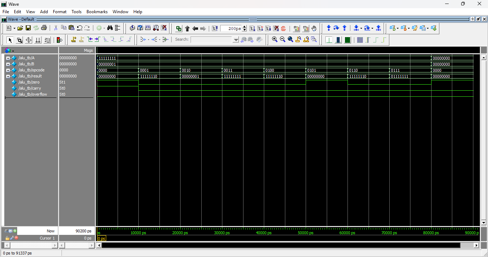

# 8-bit ALU using Verilog

## Description
This project implements an 8-bit Arithmetic Logic Unit (ALU) using Verilog HDL. 
The ALU performs arithmetic, logical, and shift operations based on the opcode input.

## Features

### Arithmetic Operations
- Addition
- Subtraction

### Logical Operations
- AND
- OR
- XOR
- NOT

### Shift Operations
- Left Shift
- Right Shift

### Status Flags
- Zero Flag
- Carry Flag
- Overflow Flag

## Tools Used
- ModelSim
- Verilog HDL

## Files Included
- alu.v (Design file)
- alu_tb.v (Testbench)

## Simulation
The design is verified using a testbench in ModelSim by applying different opcodes and inputs.

## Output Waveform

## Author
Ajai
